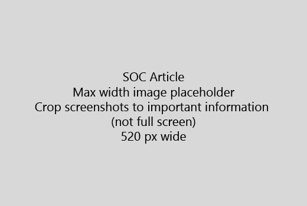

Starten Sie den Artikel mit einer sehr kurze Einführung (1 Satz). Der Leser direkten - selber Warum Hier werden? Was sollten sie tun?Start your article with a very short introduction (1 sentence). Put yourself in the reader's place - why are they here? What should they do? 
  
1. Rufen Sie direkt in eine Liste der Schritte, um die Aufgabe auszuführen.Get straight to a quick list of steps to accomplish the task.
    
    Wenn Sie ein Konzept erläutern müssen oder vorausgesetzte Schritte haben, fügen Sie eine schnelle Zusammenfassung unterhalb der Stufe, in dem sie und [Link](https://support.office.com/article/f37e7984-cf03-4fde-92d3-82970d7e241b.aspx) zum Konzept oder Schritte benötigen, hinzu.If you need to explain a concept, or they have to do pre-requisite steps, add a quick summary below the step where they need it, and [link](https://support.office.com/article/f37e7984-cf03-4fde-92d3-82970d7e241b.aspx) to the concept or steps. 
    
2. Behalten Sie kurze - Prozeduren vorzugsweise 5 oder weniger Schritte, die nicht mehr als 8.Keep procedures short - preferably 5 or fewer steps, no more than 8.
    
3. Verwenden Sie **Benutzeroberflächen-Styleguide** für Elemente der Benutzeroberfläche oder für Text Personen eingeben müssen.Use **Ui style** for user interface elements or for text people need to enter. 
    
4. Verwenden Sie die Verben wählen, ausgewählt haben, oder geben Sie als Aktionen und Menüs als **im Menü** format \> **Befehl**.Use the verbs choose, select, or enter as actions, and format menus as **Menu** \> **Command**.
    
5. Optional fügen Sie einen Screenshot für den Kontext hinzu (wenn Benutzeroberfläche schwierig ist zu suchen oder diese für die Durchführung die Aufgabe erforderlich ist).Optionally, add a screenshot for context (if UI is hard to locate, or it's needed to complete the task).
    
    Maximale Breite: 520 Pixel. Verwenden Sie standard Design, nicht mehr zeigen Sie alle persönlichen Informationen an, und zum Anzeigen von nur was relevant ist zuzuschneiden.Maximum width: 520 pixels. Use a standard theme, do not show any personal information, and crop to show only what's relevant. 
    
    
  
Hinzufügen einer Video- oder Screenshot, verwenden Sie eine zweispaltige Raster und verfügen über die Schritte in der linken und Video oder Screenshot in rechts - finden Sie unter [Schritte und Beispiel video Raster](https://support.office.com/article/14ce8e82-efa0-47f5-bb84-94f078db3dae.aspx).If you want to add a video or screenshot, use a two-column grid and have the steps in the left and the video or screenshot in the right - see [Steps and video grid example](https://support.office.com/article/14ce8e82-efa0-47f5-bb84-94f078db3dae.aspx). 
  
Ziel: nicht mehr als 500 Wörter für einen Artikel.Target no more than 500 words for an article.
  
# Beispiel-ArtikelExample article

[Mein Foto ändernChange my photo](https://support.office.com/article/555376e0-1fca-49ba-8434-307a0525c767.aspx)
  

