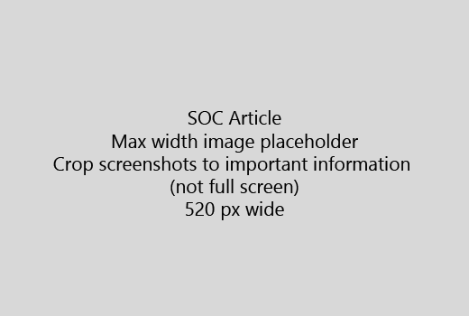

Starten Sie den Artikel mit einer sehr kurze Einführung (1 Satz). Der Leser direkten - selber Warum Hier werden? Was sollten sie tun? 
  
1. Rufen Sie direkt in eine Liste der Schritte, um die Aufgabe auszuführen.
    
    Wenn Sie ein Konzept erläutern müssen oder vorausgesetzte Schritte haben, fügen Sie eine schnelle Zusammenfassung unterhalb der Stufe, in dem sie und [Link](https://support.office.com/article/f37e7984-cf03-4fde-92d3-82970d7e241b.aspx) zum Konzept oder Schritte benötigen, hinzu. 
    
2. Behalten Sie kurze - Prozeduren vorzugsweise 5 oder weniger Schritte, die nicht mehr als 8.
    
3. Verwenden Sie **Benutzeroberflächen-Styleguide** für Elemente der Benutzeroberfläche oder für Text Personen eingeben müssen. 
    
4. Verwenden Sie die Verben wählen, ausgewählt haben, oder geben Sie als Aktionen und Menüs als **im Menü** format \> **Befehl**.
    
5. Optional fügen Sie einen Screenshot für den Kontext hinzu (wenn Benutzeroberfläche schwierig ist zu suchen oder diese für die Durchführung die Aufgabe erforderlich ist).
    
    Maximale Breite: 520 Pixel. Verwenden Sie standard Design, nicht mehr zeigen Sie alle persönlichen Informationen an, und zum Anzeigen von nur was relevant ist zuzuschneiden. 
    
    
  
Hinzufügen einer Video- oder Screenshot, verwenden Sie eine zweispaltige Raster und verfügen über die Schritte in der linken und Video oder Screenshot in rechts - finden Sie unter [Schritte und Beispiel video Raster](https://support.office.com/article/14ce8e82-efa0-47f5-bb84-94f078db3dae.aspx). 
  
Ziel: nicht mehr als 500 Wörter für einen Artikel.
  
# Beispiel-Artikel

[Mein Foto ändern](https://support.office.com/article/555376e0-1fca-49ba-8434-307a0525c767.aspx)
  

