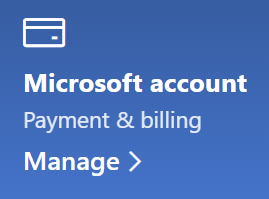

# Ändern meiner Microsoft-Kontoinformationen

Navigieren Sie zu [https://account.microsoft.com](https://account.microsoft.com/), und melden Sie sich gegebenenfalls an. Damit gelangen Sie zum Dashboard Ihres Kontos.  

**Bearbeiten meines Namens und meiner persönlicher Informationen**

1. Klicken Sie auf dem Dashboard Ihres Kontos neben dem Bild und Namen Ihres Kontos auf **Weitere Aktionen > Profil bearbeiten**.
2. Verwenden Sie auf der Seite **Profil bearbeiten** die bereitgestellten Links, um Ihr Profilbild, Ihren Namen, Ihr Geburtsdatum, Ihren Standort und Ihre Anzeigesprache zu ändern. Notieren Sie sich die Links zu Ihren Xbox- oder Skype-Kontoprofilen, in denen Sie die Details ändern können, die für diese Konten spezifisch sind.

**Verwalten von E-Mail-Adressen und Telefonnummern**

Einem Microsoft-Konto ist mindestens eine E-Mail-Adresse oder Telefonnummern als "Alias" zugeordnet. So verwalten Sie diese:

1. Klicken Sie auf dem Dashboard Ihres Kontos neben dem Bild und Namen Ihres Kontos auf **Weitere Aktionen > Profil bearbeiten**.
2. Klicken Sie auf der Seite **Profil bearbeiten** auf **Anmeldung bei Microsoft verwalten**. 
3. Eine Liste der Kontoaliase wird angezeigt, die Sie z. B. durch Hinzufügen und Löschen von E-Mail-Adressen und Telefonnummern verwalten können. Hier können Sie auch auswählen, welche Aliase für die Anmeldung bei dem Konto verwendet werden können, und welcher Alias als "primärer Alias" gilt und auf Ihren Windows 10-Geräten angezeigt wird.

**Verwalten von Zahlungsmethoden sowie Name und Adresse für die Abrechnung** 

1. Klicken Sie auf dem Dashboard Ihres Kontos neben dem Bild und Namen Ihres Kontos auf **Weitere Aktionen > Profil bearbeiten**.
2. Klicken Sie unter **Zahlung und Abrechnung** auf **Verwalten**.

    

3. Hier können Sie Zahlungsmethoden sowie die zugehörigen Rechnungsadressen hinzufügen, bearbeiten und entfernen. 
