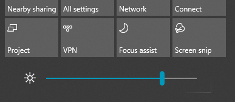

# Ändern der Bildschirmhelligkeit in Windows 10Change screen brightness in Windows 10

Wenn Ihr Windows 10 neuer als Version 1903 ist, verfügt es über einen **Helligkeitsschieberegler** im Info-Center.If your Windows 10 is newer than version 1903, it has a **Brightness slider** in the action center. Zum Öffnen des Info-Centers klicken Sie auf der rechten Seite der Taskleiste auf die Schaltfläche **Benachrichtigung** oder drücken Sie auf der Tastatur **Windows Home + A**.To open the action center, click the **Notification** button at the rightmost side of your taskbar, or press **Windows home + A** on your keyboard.

Wenn Ihr Windows 10 eine frühere Version ist, finden Sie den Helligkeitsregler unter **[Einstellungen > System > Anzeige](ms-settings:display?activationSource=GetHelp)**.If your Windows 10 is an earlier version, you can find the brightness slider by going to **[Settings > System > Display](ms-settings:display?activationSource=GetHelp)**.

**Hinweise**:**Notes**:

- Möglicherweise wird der Regler "Helligkeit ändern" für integrierte Anzeigen auf Desktop-PCs mit einem externen Monitor nicht angezeigt.You might not see the Change brightness for the built-in display slider on desktop PCs that have an external monitor. Wenn Sie die Helligkeit eines externen Monitors ändern möchten, verwenden Sie die Steuerelemente auf dem Bildschirm.To change the brightness of an external monitor, use the controls on the monitor.
- Wenn Sie keinen Desktop-PC besitzen und der Schieberegler nicht angezeigt wird oder funktioniert, versuchen Sie, den Bildschirmtreiber zu aktualisieren.If you don't have a desktop PC and the slider doesn't appear or work, try updating the display driver. Geben Sie **Geräte-Manager** in das Suchfeld in der Taskleiste ein und wählen Sie dann **Geräte-Manager** aus der Ergebnisliste aus.In the search box on the taskbar, type **Device Manager**, and then select **Device Manager** from the list of results. Wählen Sie in **Geräte-Manager** **Grafikkarte** aus und wählen Sie dann die Option „Grafikkarte“ aus.In **Device Manager**, select **Display adapters**, then select the display adapter. Drücken und halten Sie den Namen der Grafikkarte gedrückt (oder klicken Sie mit der rechten Maustaste) und klicken Sie auf **Treiber aktualisieren**; folgen Sie dann den Anweisungen.Press and hold (or right-click) the display adapter name and click **Update driver**; then follow the instructions.
