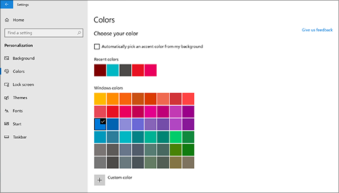
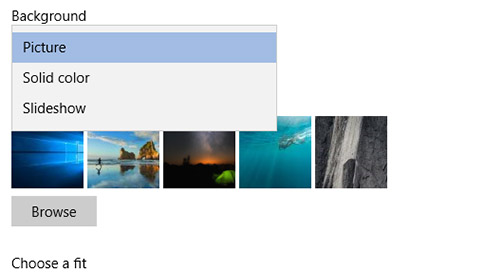

# Ändern des Desktophintergrunds und der FarbenChange your desktop background and colors

Um Ihre Farbeneinstellung zu ändern, wechseln Sie zu **Start**  >  **Settings**  >  **Personalisierung**  >  **Colors**, und wählen Sie dann Ihre eigene Farbe oder lassen Sie Windows eine Akzentfarbe aus dem Hintergrund ziehen.To change your colors setting, go to **Start** > **Settings** > **Personalization** > **Colors**, and then choose your own color or let Windows pull an accent color from your background.

Um Ihren Desktop Hintergrund zu ändern, wechseln Sie zu **Start**  >  **Settings**  >  **Personalisierung**  >  **Background**, und wählen Sie dann ein Bild, eine Volltonfarbe oder eine Diashow mit Bildern aus.To change your desktop background, go to **Start** > **Settings** > **Personalization** > **Background**, and then choose a picture, solid color, or create a slideshow of pictures. 

Möchten Sie mehr Desktop Hintergründe und-Farben?Want more desktop backgrounds and colors? Besuchen Sie [Microsoft Store](https://www.microsoft.com/store/collections/windowsthemes) , um aus Dutzenden kostenloser Designs auszuwählen.Visit [Microsoft Store](https://www.microsoft.com/store/collections/windowsthemes) to choose from dozens of free themes.
