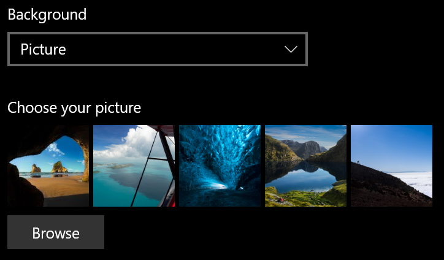
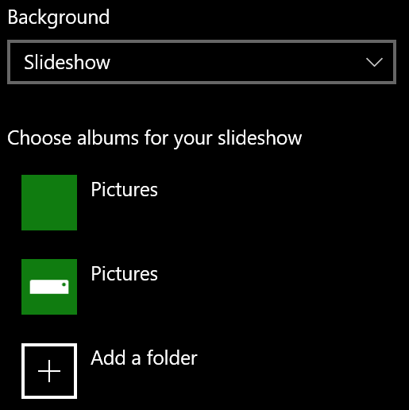

# Ändern des Sperrbildschirmhintergrunds

- Wechseln Sie zu  >  **Einstellungen Personalisierung**  >  **Sperrbildschirm**. Oder klicken oder tippen Sie [hier](ms-settings:lockscreen?activationSource=GetHelp).

- Wenn Sie ein benutzerdefiniertes Hintergrundbild festlegen möchten, wählen  Sie **in** der Dropdownliste **Hintergrund** Bild aus, und wählen Sie das Bild aus, oder navigieren Sie zu dem Bild.

  

- Wenn Sie eine Bildschirmpräsentation mit  benutzerdefinierten Bildern einrichten möchten, wählen Sie in der Dropdownliste Hintergrund die Option Bildschirmpräsentation aus, und wählen Sie ein Album aus, oder fügen Sie einen Ordner hinzu, der die Bilder für die Bildschirmpräsentation enthält. 

  
