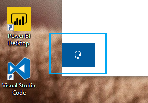

# Kontaktieren Sie uns, indem Sie auf die Kopfhörerschaltfläche klickenContact us by clicking the headphone button

Wenn Sie den Microsoft-Support kontaktieren möchten, klicken Sie **in** der unteren linken Ecke dieser App auf Kontakt.If you'd like to contact Microsoft Support, please click **Contact us** in the lower left corner of this app. Innerhalb des Fly-Out-Fensters werden Sie zum richtigen Supportkanal geführt, nachdem Sie Ihre Produkt- und Problemkategorie auswählen.Inside the fly-out window, you will be guided to the right support channel after choosing your product and issue category.

Sie können weiterhin mit dem Rest der App interagieren, auch nachdem Sie eine Contact us-Sitzung initiiert haben.You can keep interacting with the rest of the app even after you have initiated a Contact us session. Der Bereich Kontakt kann vorübergehend minimiert werden, indem Sie auf eine andere Stelle in der App klicken.The Contact us panel can be temporarily minimized by clicking anywhere else inside the app. Um zur gleichen Sitzung zurückzukehren, klicken Sie einfach erneut **auf** Kontakt.To return to the same session, just click **Contact us** again.
