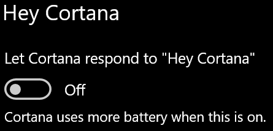

# Cortana spricht nicht mit mir oder kann mich nicht hörenCortana doesn’t talk to me or can’t hear me

Wenn Sie versuchen, die Funktion „Hallo Cortana“ zu verwenden, die es Ihnen ermöglicht, mit Cortana zu sprechen, ohne den Cortana-Button in der Taskleiste oder den Mikrofon-Button im Bedienfeld von Cortana auszuwählen, bestätigen Sie, dass die Funktion aktiviert ist:If you are trying to use the "Hey Cortana" feature, which allows you to talk to Cortana without selecting the Cortana button on the taskbar or the microphone button in the Cortana panel, confirm that the feature is enabled:

1. Wechseln Sie zu **Startseite** und wählen Sie dann **[Einstellungen > Cortana](ms-settings:cortana?activationSource=GetHelp)** aus.Go to **Start**, then select **[Settings > Cortana](ms-settings:cortana?activationSource=GetHelp)**.
2. Unter **Hallo Cortana** schalten Sie den Schalter **Cortana auf „Hallo Cortana“ reagieren lassen** auf **Ein**.Under **Hey Cortana**, switch the **Let Cortana respond to "Hey Cortana"** toggle to **On**.

**Verhindern Ihre Datenschutzeinstellungen, dass Cortana Sie hören kann?****Are your privacy settings preventing Cortana from hearing you?**

Ihre Datenschutzeinstellungen können verhindern, dass Cortana auf Ihre Stimme reagiert.Your privacy settings can prevent Cortana from responding to your voice.
- Stellen Sie sicher, dass die Online-Spracherkennung aktiviert ist:Check to make sure Online Speech recognition is turned on:
    - Wechseln Sie zu **Startseite** und klicken Sie dann auf **[Einstellungen > Datenschutz > Sprache](ms-settings:privacy-speech?activationSource=GetHelp)**.Go to **Start**, then click **[Settings > Privacy > Speech](ms-settings:privacy-speech?activationSource=GetHelp)**.
    - Schalten Sie unter **Online-Spracherkennung** die Einstellung auf **Ein**.Under **Online speech recognition**, switch the setting to **On**.
- Stellen Sie sicher, dass Cortana die Berechtigung hat, auf Ihr Mikrofon zuzugreifen.Check to make sure Cortana has permission to access your microphone. 
    - Wechseln Sie zu Startseite und klicken Sie dann auf **[Einstellungen > Datenschutz > Mikrofon](ms-settings:privacy-microphone?activationSource=GetHelp)**.Go to Start, then click **[Settings > Privacy > Microphone](ms-settings:privacy-microphone?activationSource=GetHelp)**.
    - Suchen Sie unter **Wählen Sie welche Anwendungen auf Ihr Mikrofon zugreifen können** in der Liste der Anwendungen und Dienste nach **Cortana** und stellen Sie sicher, dass der Schalter auf **Ein** geschaltet ist. Under **Choose which apps can access your microphone**, look for **Cortana** within the list of apps and services and make sure the switch is toggled to **On**.

Bitte vergewissern Sie sich auch, dass Ihre Lautsprecher oder Mikrofone funktionieren, damit Sie mit Cortana sprechen können.Moreover, please also make sure that your speakers or microphones are up and working in order to talk to Cortana.
