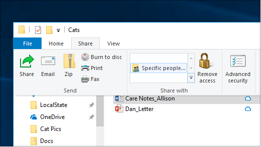
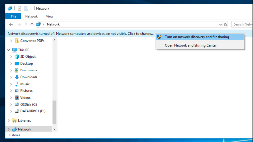

# Dateifreigabe über ein Netzwerk in Windows 10File sharing over a network in Windows 10

**Hinweis**: Wenn Sie zuvor HomeGroup für die Dateifreigabe verwendet haben, beachten Sie, dass HomeGroup aus Windows 10 (Version 1803) entfernt wurde.**Note**: If you previously used HomeGroup for file sharing, please note that HomeGroup has been removed from Windows 10 (Version 1803). Sie können jetzt Drucker und Dateien mithilfe von integrierten Features in Windows 10 freigeben.You can now share printers and files by using built-in features in Windows 10.

**So teilen Sie Dateien oder Ordner über ein Netzwerk****To share files or folders over a network**

- Wählen Sie im  Datei-Explorer eine Datei  > klicken Sie im Abschnitt Freigeben mit auf die Registerkarte Freigeben > klicken Sie im Abschnitt Freigeben mit auf Bestimmte **Personen**. In **File Explorer**, select a file > click the **Share** tab at the top > in the **Share with** section, click **Specific people**.

    
          
- Wenn Sie mehrere Dateien gleichzeitig auswählen, können Sie sie auf die gleiche Weise freigeben.If you select multiple files at once, you can share them all in the same way. Es funktioniert auch für Ordner.It works for folders, too.

**So sehen Sie Geräte im Netzwerk, die Dateien freigeben****To see devices on the network that are sharing files**

- Wechseln **Sie im Datei-Explorer** zu **Netzwerk**.In **File Explorer**, go to **Network**. Wenn die Netzwerkermittlung nicht aktiviert ist, wird die Fehlermeldung "Netzwerkermittlung ist deaktiviert..." angezeigt.If Network discovery is not enabled, you will see an error message "Network discovery is turned off..."

- Klicken Sie **auf das Banner Netzwerkermittlung ist deaktiviert,** und klicken Sie dann auf **Netzwerkerkennung und Dateifreigabe aktivieren.**Click the **Network discovery is turned off** banner, then click **Turn on network discovery and file sharing**.

    

[Weitere Informationen zur Dateifreigabe über ein NetzwerkRead more about file sharing over a network](https://support.microsoft.com/help/4092694/windows-10-file-sharing-over-a-network)

[Freigeben von Dateien mithilfe von Apps, OneDrive, E-Mails und mehrShare files using apps, OneDrive, emails, and more](https://support.microsoft.com/help/4027674/windows-10-share-files-in-file-explorer)
