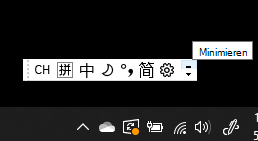
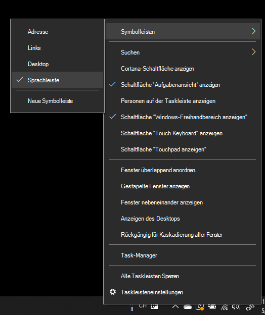
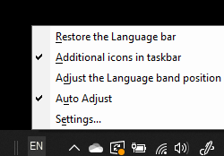

# Ausblenden, Einblenden oder Zurücksetzen der SprachenleisteHide, display, or reset the language bar

**So minimieren Sie die Sprachenleiste:****To minimize the language bar:**

Sie können auf die Schaltfläche „Minimieren“ in der oberen rechten Ecke der Sprachenleiste klicken.You can click the minimize button on the top right corner of the language bar. Alternativ können Sie die Sprachenleiste auch einfach auf die Taskleiste ziehen, wodurch sie automatisch minimiert wird.Or, you can just drag the language bar to the task bar, which will automatically minimize it.

**So docken Sie die Sprachenleiste ab:****To pop out the language bar:**

Wenn Sie die Sprachenleiste nicht an die Taskleiste anheften möchten, klicken Sie in der Taskleiste mit der rechten Maustaste auf einen leeren Bereich, und deaktivieren Sie die Option **Sprachenleiste** im Menü „Symbolleisten“.If you don't want to dock the language bar in the taskbar, right-click any empty space in the taskbar, and uncheck the **Language bar** option in the Toolbars menu. Dadurch wird die Sprachenleiste außerhalb der Taskleiste angezeigt, wie im vorherigen Screenshot.This will make the language bar appear outside the taskbar, just like the previous screenshot.

**So stellen Sie die standardmäßige Sprachenleiste wieder her:****To restore the language bar to default:**

Klicken Sie mit der rechten Maustaste auf die Schaltfläche „Sprache“ in der Symbolleiste, und klicken Sie dann im Menü auf die Option **Sprachenleiste wiederherstellen**.Right-click the language button in the toolbar, and click **Restore the language bar** option in the menu. Dadurch wird sie auf die Standardeinstellungen zurückgesetzt.This will restore it to default.

