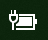

# Stromversorgungs- oder Akkusymbol fehlt in Windows 10Power or battery icon missing in Windows 10

Wenn Ihr Windows 10-Gerät über einen Akku verfügt (z.B. einen Laptop oder ein Tablet oder einen über USB an eine USV angeschlossenen PC), wird in der Taskleiste normalerweise neben der Uhr ein Stromversorgungs-/Akkusymbol angezeigt. Beispiel:If your Windows 10 device has a battery (e.g., laptop or tablet, or a PC connected via USB to a UPS), normally a power/battery icon is shown in the taskbar near the clock, for example:

Wenn Sie dieses Symbol nicht sehen, wird es möglicherweise ausgeblendet:If you don't see this icon, it may be hidden:

1. Wechseln Sie zu **[Einstellungen > Personalisierung > Taskleiste](ms-settings:taskbar?activationSource=GetHelp)**.Go to **[Settings > Personalization > Taskbar](ms-settings:taskbar?activationSource=GetHelp)**.

2. Klicken Sie im Bereich Benachrichtigung auf **Auswählen, welche Symbole in der Taskleiste angezeigt werden**.In the Notification area, click **Select which icons appear on the taskbar**.

3. Suchen Sie dann das **Power**-Element in der Liste und schalten Sie die Einstellung auf **Ein**.Then find the **Power** item in the list and toggle its setting to **On**.

    

**Problembehandlung****Troubleshooting**

Wenn Sie die obigen Anweisungen befolgt haben und der **Power**-Schalter ausgegraut oder nicht sichtbar ist, geben Sie im Suchfeld in der Taskleiste den **Geräte-Manager** ein und wählen Sie dann **Geräte-Manager** in der Ergebnisliste aus.If you followed the above instructions and the **Power** toggle is greyed out or not visible, in the search box on the taskbar, type **device manager**, and then select **Device Manager** in the list of results. Klicken Sie unter **Akkus** mit der rechten Maustaste auf den Akku für Ihr Gerät, klicken Sie auf **Deaktivieren** und dann auf **Ja**.Under **Batteries**, right-click the battery for your device, click **Disable**, and click **Yes**. Warten Sie einige Sekunden, klicken Sie dann mit der rechten Maustaste auf den Akku und klicken Sie auf **Aktivieren**.Wait a few seconds, and then right-click the battery and click **Enable**. Starten Sie dann Ihr Gerät neu.Then restart your device.

Wenn Sie die obigen Anweisungen befolgt haben, das Akkusymbol jedoch nicht in der Taskleiste angezeigt wird, geben Sie im Suchfeld in der Taskleiste **Task-Manager** ein und klicken Sie dann in der Ergebnisliste auf **Task-Manager**.If you followed the above instructions, but the battery icon does not appear on the taskbar, in the search box on the taskbar, type **task manager**, and then click **Task Manager** in the list of results. Klicken Sie auf der Registerkarte **Prozesse** unter **Name** mit der rechten Maustaste auf **Explorer**, und klicken Sie dann auf **Neustarten**.On the **Processes** tab, under **Name**, right-click **Explorer**, and then click **Restart**.
