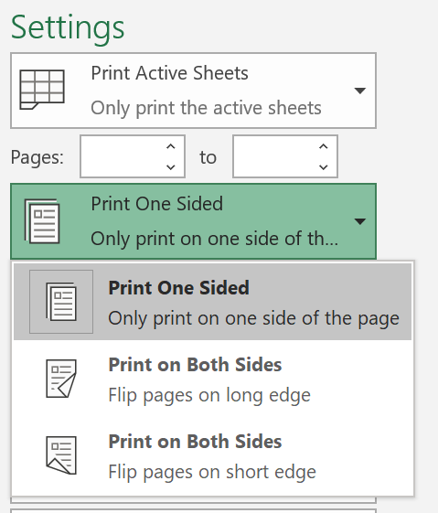
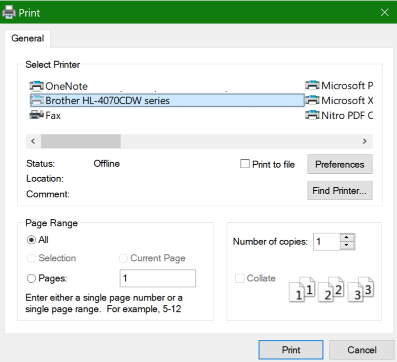

# Beidseitiges Bedrucken von Papier (Duplexdruck)Printing on both sides of paper (duplex printing)

**Wird Duplexdruck auf meinem Drucker unterstützt?****Is my printer capable of duplex printing?**

In der Funktionsübersicht oder im Handbuch Ihres Druckers sollten Sie nachlesen können, ob er beidseitiges Bedrucken von Papier, auch bekannt als „Duplexdruck“, unterstützt.Your printer’s feature summary or manual should tell you whether it is capable of printing on both sides of the paper, also known as “duplex printing.” Wenn Sie über Microsoft Office verfügen, können Sie dies auch herausfinden, indem Sie eine Office-App wie Word oder Excel öffnen, auf **Datei > Drucken** wechseln, sicherstellen, dass der richtige Drucker ausgewählt ist, und im Abschnitt „Einstellungen“ nach der Funktion suchen.If you have Microsoft Office, another way to find out is by opening an Office app like Word or Excel, going to **File > Print**, making sure the right printer is selected, and looking for the capability in the Settings section. Zum Beispiel:For example: 

**Duplexdruck in Microsoft Office****Duplex printing in Microsoft Office**

Wenn Ihr Drucker beidseitiges Bedrucken unterstützt, dann sehen Sie, wenn Sie in der Office-App auf **Datei > Drucken** wechseln, die Option „Beidseitiges Bedrucken“, wie im obigen Beispiel gezeigt.If your printer is capable of printing on both sides, when you go to **File > Print** in the Office app, you will see an option to “Print on Both Sides,” as shown in the example above.  Wählen Sie die gewünschte Duplexdruckform aus (auf der langen Seite kippen oder auf der kurzen Kante kippen), und klicken Sie auf **Drucken**, um den Ausdruck zu starten.Select the type of duplex printing you want (flip on long edge, or flip on short edge), and click **Print** to start the printout.

**Duplexdruck aus einer beliebigen Anwendung****Duplex printing from any application**

In vielen Apps sehen Sie beim Drucken ein allgemeines Dialogfeld „Drucken“, das wie folgt aussieht:In many apps when you print you will see a general print dialog that looks like this: 

Vergewissern Sie sich, dass der richtige Drucker ausgewählt ist, und klicken Sie dann auf Einstellungen, um das Fenster mit den **Druckereinstellungen** zu öffnen.Make sure the right printer is selected, then click **Preferences** to open the printer preferences window. Wenn der Drucker den Duplexdruck unterstützt, wird die Aktivierung dieser Funktion für den aktuellen Druckauftrag in diesem Fenster angezeigt.If the printer is capable of duplex printing, the ability to enable this for the current print job will show in that window.
