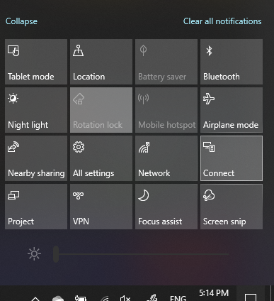

# Auf einen PC projizierenProject to a PC

Suchen Sie auf Ihrem Zielgerät (auf das projiziert werden soll) nach „Projektionseinstellungen“, um die Einstellungsseite von **Auf diesen PC projizieren** zu öffnen.On your destination device (projecting to), search for "Projection Settings" to open the Settings page of **Projecting to this PC**. Stellen Sie dann Folgendes sicher:Then make sure that:
- Das Dropdownmenü "Einige Windows- und Android-Geräte können auf diesen PC projizieren, wenn Sie zustimmen“ ist auf **Immer aus** festgelegt."Some Windows and Android devices can project to this PC when you say it's OK" drop-down menu is set to **Always Off**.
- Das Dropdownmenü „Nachfragen, ob auf diesen PC projiziert werden soll“ ist auf **Jedes Mal, wenn eine Verbindung erforderlich ist** festgelegt."Ask to project to this PC" drop-down menu is set to **Every time a connection is required**.
- Das Dropdownmenü „PIN ist für das Pairing erforderlich“ ist auf **Nie** festgelegt."Require PIN for pairing" drop-down menu is set to **Never**.

Starten Sie auf Ihrem Zielgerät die App **Verbinden**, indem Sie zu **Start** wechseln und nach „Verbinden“ suchen.On your destination device, launch **Connect** app by going to **Start** and search for "Connect".

Führen Sie dann auf Ihrem Quellgerät, von dem aus Sie projizieren möchten, Folgendes aus:Then, on your source device that you are trying to project from:

1. Drücken Sie die **Windows-Taste + A**, um das Info-Center zu öffnen.Press **Windows key + A** to open Action Center.
2. Klicken Sie auf **Verbinden**.Click **Connect**.
3. Klicken Sie auf das Gerät, auf das Sie den Bildschirm projizieren möchten.Click the device you want to project the screen to.

Nach den vorstehenden Schritten sollte Ihr Zielgerät den Bildschirm des Quellgeräts anzeigen, als ob es sich um einen sekundären Monitor handelt.After the above steps, your destination device should display the screen of the source device as if it is a secondary monitor.
