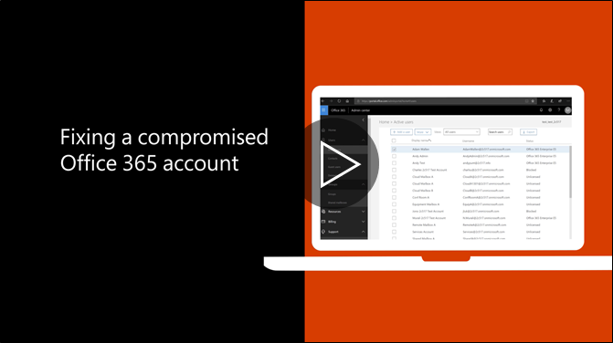

# Empfohlenen Maßnahmen, wenn ein Konto ist gefährdet

  
1. Sofort [das Kennwort des Benutzers zurücksetzen](https://support.office.com/article/7a5d073b-7fae-4aa5-8f96-9ecd041aba9c) . Kommunizieren Sie das neue Kennwort per e-Mail nicht für den Endbenutzer. 
    
2. Entfernen Sie alle verdächtigen [Weiterleiten von Adressen](https://support.office.com/article/ab5eb117-0f22-4fa7-a662-3a6bdb0add74) auf Postfachebene festgelegt. 
    
3. Entfernen Sie alle verdächtigen [Posteingangsregeln](https://support.office.com/article/1433E3A0-7FB0-4999-B536-50E05CB67FED) innerhalb des Postfachs festgelegt. 
    
4. Wenn der Benutzer am Senden von e-Mails, die [an die Benutzer mit eingeschränktem Zugriff zum Aufheben der Blockierung von des Kontos umgeleitet wird](https://protection.office.com/?hash=/restrictedusers)ausgeschlossen wird. Abschließend sollte der Benutzer Nachrichten senden können innerhalb einer Stunde fortsetzen können.
    
5. Entfernen Sie das Benutzerkonto aus allen [Gruppen der Verwaltungsrolle](https://support.office.com/article/eac4d046-1afd-4f1a-85fc-8219c79e1504) , bis Sie davon überzeugt sind, dass das Konto nicht mehr gefährdet ist. 
    
Es wird empfohlen, um das Potenzial der Verletzung Daten oder einem kompromittierten Konto in der Zukunft zu minimieren, unsere [Sicherheit in Office 365 best Practices Artikel](https://support.office.com/article/9295e396-e53d-49b9-ae9b-0b5828cdedc3)lesen.
  

