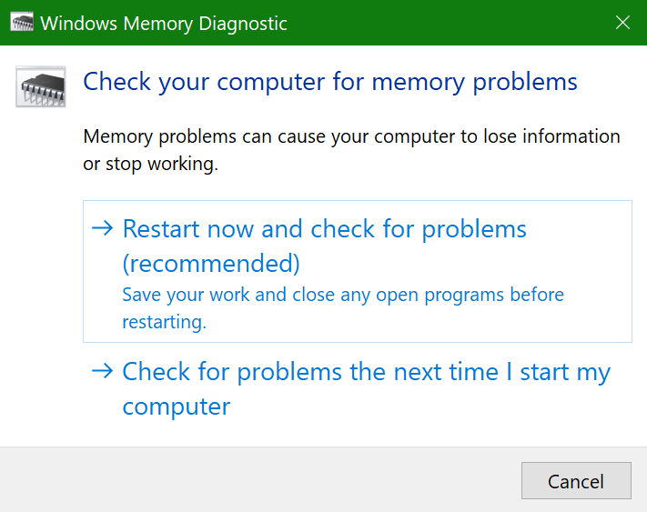
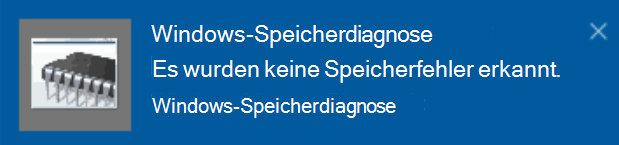

# Ausführen von Windows-Speicherdiagnose in Windows 10Run Windows Memory Diagnostics in Windows 10

Wenn Windows und Apps auf Ihrem PC abstürzen, einfrieren oder sich instabil verhalten, haben Sie möglicherweise ein Problem mit dem Arbeitsspeicher (RAM) des PCs.If Windows and apps on your PC are crashing, freezing, or acting in an unstable manner, you may have a problem with the PC’s memory (RAM). Sie können die Windows-Speicherdiagnose ausführen, um nach Problemen mit dem Arbeitsspeicher des PCs zu suchen.You can run the Windows Memory Diagnostic to check for problems with the PC’s RAM.

Geben Sie in das Suchfeld in der Taskleiste **Speicherdiagnose** ein, und wählen Sie dann **Windows-Speicherdiagnose**.In the search box on your taskbar, type **memory diagnostic**, and then select **Windows Memory Diagnostic**. 

Um die Diagnose auszuführen, muss der PC neu gestartet werden.To run the diagnostic, the PC needs to restart. Sie haben die Möglichkeit, sofort neu zu starten (bitte speichern Sie Ihre Arbeit und schließen Sie zuerst geöffnete Dokumente und E-Mails), oder Sie können die Diagnose so planen, dass sie beim nächsten Neustart des PCs automatisch ausgeführt wird:You have the option to restart immediately (please save your work and close open documents and e-mails first), or schedule the diagnostic to run automatically the next time the PC restarts:

Wenn der PC neu gestartet wird, wird das **Windows-Speicherdiagnosetool** automatisch ausgeführt.When the PC restarts, the **Windows Memory Diagnostics Tool** will run automatically. Status und Fortschritt werden während des Diagnoselaufs angezeigt, und Sie haben die Möglichkeit, die Diagnose durch Drücken der Taste **ESC** auf Ihrer Tastatur abzubrechen.Status and progress will be displayed as the diagnostics run, and you have the option of cancelling the diagnostics by hitting the **ESC** key on your keyboard.

Nach Abschluss der Diagnose wird Windows normal gestartet.When the diagnostics are complete, Windows will start normally.
Unmittelbar nach dem Neustart, wenn der Desktop angezeigt wird, erscheint eine Benachrichtigung (neben dem Symbol  **Info-Center** in der Taskleiste), um anzuzeigen, ob Speicherfehler gefunden wurden.Immediately after restart, when the Desktop appears, a notification will appear (next to the **Action Center** icon on the taskbar), to indicate whether any memory errors were found. Zum Beispiel:For example:

Das ist das Symbol „Info-Center“:Here's the Action Center icon:  

Und eine Beispiel-Benachrichtigung:And a sample notification: 

Wenn Sie die Benachrichtigung verpasst haben, können Sie das Symbol **Info-Center** in der Taskleiste wählen, um das **Info-Center** anzuzeigen und eine scrollbare Liste der Benachrichtigungen zu sehen.If you missed the notification, you can select the **Action Center** icon  on the taskbar to display the **Action Center** and see a scrollable list of notifications.

Um detaillierte Informationen zu überprüfen, geben Sie das **Ereignis** in das Suchfeld in Ihrer Taskleiste ein und wählen Sie dann **Ereignisanzeige**.To review detailed information, type **event** into the search box on your taskbar, and then select **Event Viewer**. Navigieren Sie im linken Fensterbereich der **Ereignisanzeige** zu **Windows-Protokolle > System**.In the **Event Viewer**’s left-hand pane, navigate to **Windows Logs > System**. Scannen Sie im rechten Fensterbereich die Liste nach unten, während Sie die Spalte **Quelle** betrachten, bis Sie Ereignisse mit dem Quellenwert **MemoryDiagnostics-Results** sehen.In the right-hand pane, scan down the list while looking at the **Source** column, until you see events with Source value **MemoryDiagnostics-Results**. Markieren Sie jedes dieser Ereignisse und sehen Sie die Ergebnisinformationen im Feld unter der Registerkarte **Allgemein** unterhalb der Liste.Highlight each such event and see the result information in the box under the **General** tab below the list.
