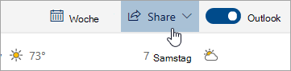

# Freigabe mit Outlook im WebSharing with Outlook on the web

Wählen Sie aus Ihrem Kalender aus der Symbolleiste oben auf der Seite die Option  **Freigeben** und dann den Kalender aus, den Sie freigeben möchten.From your Calendar, on the toolbar at the top of the page, select **Share**, and choose the calendar you want to share.

    

**Hinweis**: Sie können Kalender, die im Besitz anderer Personen sind, nicht freigeben.**Note**: You can't share calendars owned by other people.

- Geben Sie den Namen oder die E-Mail-Adresse der Person ein, für die Sie Ihren Kalender freigeben möchten.Enter the name or email address of the person you want to share your calendar with.
- Wählen Sie aus, wie Ihr Kalender von der Person verwendet werden soll:Choose how you want the person to use your calendar:
    - Bei Auswahl von **Kann sehen, wenn ich beschäftigt bin**  kann die Person sehen, wann Sie beschäftigt sind, es werden jedoch keine Details wie z. B. der Veranstaltungsort angezeigt.**Can view when I'm busy** lets them see when you're busy but doesn't include details like the event location.
    - Bei Auswahl von **Kann Titel und Orte anzeigen**  kann die Person sehen, wann Sie beschäftigt sind, und es werden Titel und Ort der Ereignisse angezeigt.**Can view titles and locations** lets them see when you're busy, as well as the title and location of events.
    - Bei Auswahl von **Kann anzeigen**  kann die Person alle Details Ihrer Ereignisse sehen.**Can view all details** lets them see all the details of your events.
    - Bei Auswahl von **Kann anzeigen**  kann die Person Ihren Kalender bearbeiten.**Can edit** lets them edit your calendar.
    - Bei Auswahl von **Übertragen** kann die Person Ihren Kalender bearbeiten und mit anderen teilen.**Delegate** lets them edit your calendar and share it with others.
- Wählen Sie  **Freigeben** aus.Select **Share**.
