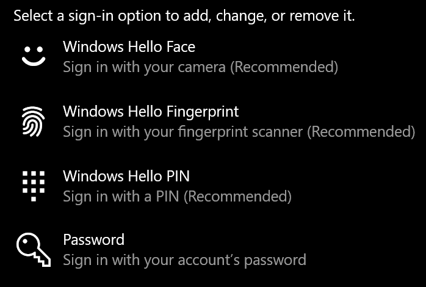
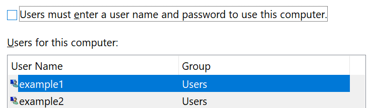

# Anmeldung bei Windows 10 ohne Verwendung eines Kennworts

Um zu vermeiden, dass beim Windows-Start ein Kennwort eingegeben werden muss, empfehlen wir Ihnen, wenn verfügbar, eine der Windows Hello Secure-Anmeldeoptionen wie PIN, Face Recognition oder Fingerabdruck. Wenn Sie die sichere Anmeldung wirklich deaktivieren möchten, lesen Sie die Anweisungen unter "Automatisches Anmelden bei Windows 10".

**Sichere Windows Hello-Alternativen zum Kontokennwort**

Wechseln Sie zu **Einstellungen > Konten > Anmeldeoptionen** (oder klicken Sie [hier](ms-settings:signinoptions?activationSource=GetHelp)). Die verfügbaren Anmeldeoptionen werden aufgelistet. Beispiel:

Klicken oder tippen Sie auf eine der Optionen, um Sie zu konfigurieren. Wenn Sie das nächste Mal Windows starten oder entsperren, können Sie die neue Option anstelle eines Kennworts verwenden. 

**Automatisches Anmelden bei Windows 10**

**Hinweis**: die automatische Anmeldung ist praktisch, führt jedoch ein Sicherheitsrisiko ein, insbesondere dann, wenn Ihr PC von mehreren Personen zugänglich ist. 

1. Klicken oder tippen Sie auf die Schaltfläche **Start** in der Taskleiste.

2. Geben Sie **netplwiz** ein, und drücken Sie die EINGABETASTE, um das Fenster Benutzerkonten zu öffnen.

3. Klicken Sie unter **Benutzerkonten**auf das Konto, für das Sie sich beim Start von Windows automatisch anmelden möchten.

4. Deaktivieren Sie das Kontrollkästchen "Benutzer müssen einen Benutzernamen und ein Kennwort für die Verwendung dieses Computers eingeben".

    

5. Klicken Sie auf **OK**. Sie werden aufgefordert, das Kennwort für das ausgewählte Konto einzugeben und zu bestätigen. Klicken Sie zum Abschließen auf **OK**. Das nächste Mal, wenn Windows 10 gestartet wird, wird es sich automatisch bei dem ausgewählten Konto anmelden.
