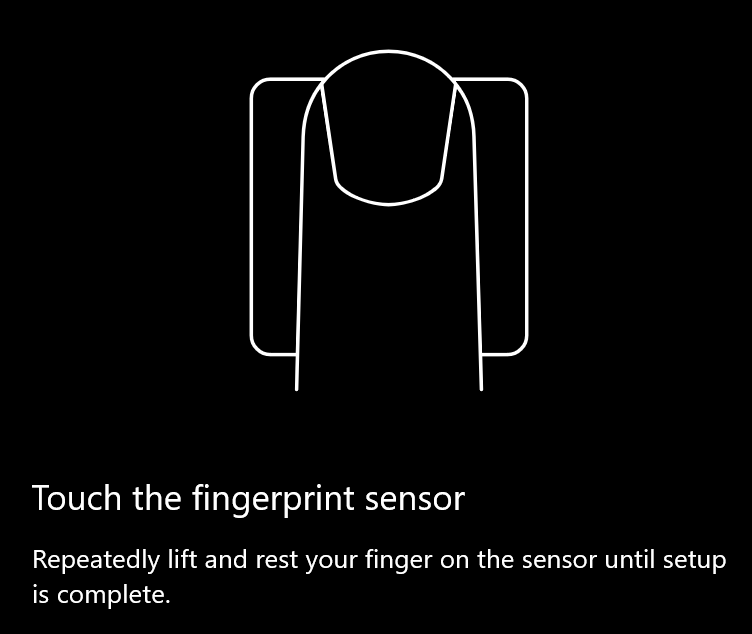
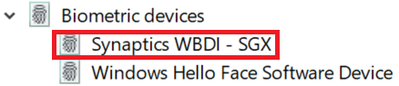

# Verwenden von Fingerabdruck-Unlock-Option in Windows 10Use fingerprint unlock option in Windows 10

**Windows Hello-Fingerabdruck aktivieren****Enable Windows Hello Fingerprint**

Wenn Sie Windows 10 mit Ihrem Fingerabdruck entsperren möchten, müssen Sie Windows Hello Fingerprint einrichten, indem Sie mindestens einen Finger hinzufügen (sodass Windows erkennen kann, dass er Sie erkennt).To unlock Windows 10 using your fingerprint, you need to set up Windows Hello Fingerprint by adding (letting Windows learn to recognize) at least one finger. 

1. Wechseln Sie zu **Einstellungen > Konten > Anmeldeoptionen** (oder klicken Sie [hier](ms-settings:signinoptions?activationSource=GetHelp)).Go to **Settings  > Accounts > Sign-in options** (or click [here](ms-settings:signinoptions?activationSource=GetHelp)). Die verfügbaren Anmeldeoptionen werden aufgelistet.Available sign-in options will be listed. Zum Beispiel:For example:

    

2. Klicken oder tippen Sie auf **Windows Hello Fingerprint**, und klicken Sie dann auf **Einrichten**.Click or tap **Windows Hello Fingerprint**, then click **Set up**. Klicken Sie im Fenster Hello Setup von Windows auf **Erste Schritte**.In the Windows Hello setup window, click **Get started**. Der Fingerabdrucksensor wird aktiviert, und Sie werden aufgefordert, Ihren Finger auf den Sensor zu setzen:The fingerprint sensor will activate, and you'll be asked to place your finger on the sensor:

   

3. Befolgen Sie die Anweisungen, die Sie bitten, Ihren Finger wiederholt zu überprüfen.Follow the instructions, which will ask you to repeatedly scan your finger. Wenn dieser Vorgang abgeschlossen ist, haben Sie die Möglichkeit, weitere Finger hinzuzufügen, die Sie möglicherweise für die Anmeldung verwenden möchten.When this is finished, you'll have the option of adding other fingers you may want to use for sign-in. Wenn Sie sich das nächste Mal bei Windows 10 anmelden, haben Sie die Möglichkeit, Ihren Fingerabdruck zu verwenden.Next time you sign in to Windows 10, you will have the option of using your fingerprint to do so.

**Windows Hello Fingerabdruck nicht als Anmeldeoption verfügbar****Windows Hello Fingerprint not available as a sign-in option**

Wenn Windows Hello Fingerabdruck nicht als Option in den **Anmeldeoptionen**angezeigt wird, bedeutet dies, dass Windows keine Fingerabdruckleser/Scanner kennt, die an Ihren PC angeschlossen sind, oder dass eine Systemrichtlinie deren Verwendung verhindert (beispielsweise wenn Ihr PC von Ihrem Arbeitsplatz verwaltet wird).If Windows Hello Fingerprint is not shown as an option in **Sign-in options**, it means Windows is not aware of any fingerprint reader/scanner attached to your PC, or that a system policy prevents its use (if for example your PC is managed by your workplace). Zur Problembehandlung:To troubleshoot: 

1. Wählen Sie die Schaltfläche **Start** in der Taskleiste aus, und suchen Sie nach **Geräte-Manager**.Select the **Start** button in the Taskbar and search for **Device Manager**.

2. Klicken oder tippen Sie auf, um den **Geräte-Manager**zu öffnen.Click or tap to open **Device Manager**.

3. Erweitern Sie im Geräte-Manager biometrische Geräte, indem Sie auf dessen Chevron klicken.In Device Manager, expand Biometric devices by clicking its chevron.

   

4. Ihr Fingerabdruck-Scanner sollte als biometrisches Gerät wie der Synaptics WBDI-Scanner aufgeführt werden:Your fingerprint scanner should be listed as a biometric device, such as the Synaptics WBDI scanner:

   

5. Wenn Ihr Fingerabdruckscanner nicht angezeigt wird und der Scanner in Ihren PC integriert ist, wechseln Sie zur Website des PC-Herstellers.If your fingerprint scanner is not shown, and the scanner is integrated into your PC, go to the PC manufacturer's website. Suchen Sie im Abschnitt technischer Support für Ihr PC-Modell nach einem Windows 10-Treiber für einen Scanner, den Sie installieren können.In the technical support section for your PC model, search for a Windows 10 driver for a scanner that you can install.

6. Wenn der Scanner vom PC getrennt ist (über USB angeschlossen), wechseln Sie zur Website des Scanner-Herstellers, um die Gerätetreibersoftware von Windows 10 für das Scanner-Modell zu finden und zu installieren.If the scanner is separate from the PC (attached via USB), go to the scanner manufacturer's website to find and install Windows 10 device driver software for the scanner model you have.
