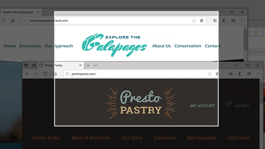
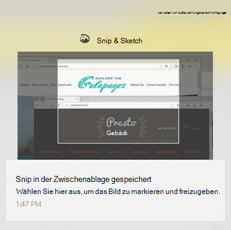

# Verwenden von Snip & Skizze zum erfassen, markieren und Freigeben von Bildern

Die Bildschirmskizze wird nun als **Snip & Skizze**bezeichnet. **So führen Sie schnell einen Ausschnitt**aus:

1. Drücken Sie die **Windows-Logo-Taste + Umschalt + S**. Sie werden sehen, wie Ihr Bildschirm verdunkelt wird und Ihr Cursor als Kreuz angezeigt wird. 

2. Wählen Sie einen Punkt am Rand des Bereichs aus, den Sie kopieren möchten, und klicken Sie mit der linken Maustaste auf den Cursor. 

3. Bewegen Sie den Cursor, um den Bereich hervorzuheben, den Sie erfassen möchten. Der erfasste Bereich wird auf dem Bildschirm angezeigt.

   

Das Bild, das Sie geschnitten haben, wird in der Zwischenablage gespeichert und kann in eine e-Mail oder ein Dokument eingefügt werden. 

**Wenn Sie das Bild bearbeiten oder anzeigen möchten**: 

- Klicken Sie auf das Symbol Benachrichtigungen auf der rechten Seite der Taskleiste; Klicken Sie dann auf das Bild, das Sie soeben erfasst haben. Ihr Snip wird in der App "Snip & Sketch" geöffnet.

   
