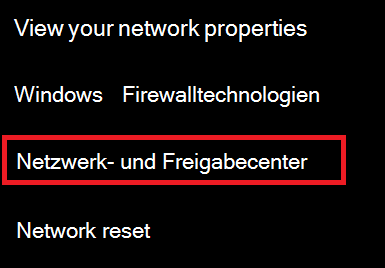
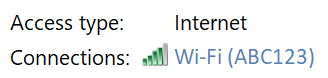
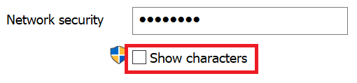

# Wi-Fi-Netzwerkkennwort in Windows 10 anzeigen

1. Stellen Sie sicher, dass Ihr Windows 10-PC mit dem Wi-Fi-Netzwerk verbunden ist.

2. Wechseln Sie zu **Einstellungen > Netzwerk & Internet > Status**, oder klicken oder tippen Sie [hier](ms-settings:network?activationSource=GetHelp) , damit wir Sie jetzt dorthin bringen können.)

3. Klicken Sie auf **Netzwerk- und Freigabecenter**.

    

4. Im **Netzwerk-und Freigabe Center**wird neben **Verbindungen**der Name Ihres drahtlosen Netzwerks angezeigt. Wenn Ihr Netzwerk beispielsweise den Namen "abc123" trägt, sehen Sie möglicherweise Folgendes:

    

    Klicken Sie auf den Namen des Drahtlosnetzwerks, um das Fenster Wi-Fi Status zu öffnen. 

5. Klicken Sie im Fenster WLAN-Status auf **drahtlose Eigenschaften**, klicken Sie auf die Registerkarte **Sicherheit** , und aktivieren Sie die Option **Zeichen anzeigen**.

    

